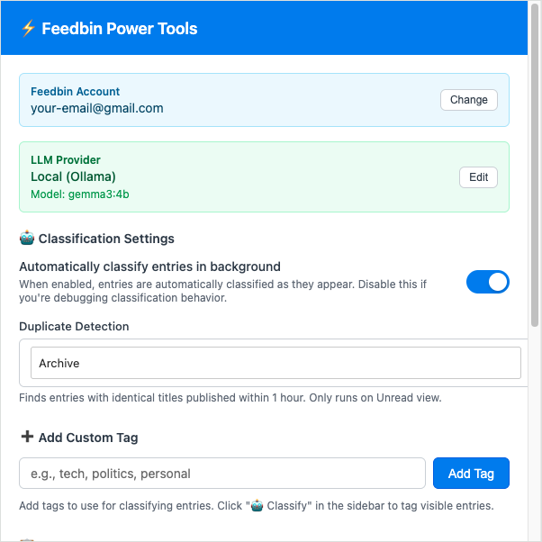

# ⚡ Feedbin Power Tools

> **Smart filtering for Feedbin** - Automatically tag and filter individual RSS entries using AI, not just entire feeds.

[](https://www.google.com/chrome/)
[](https://opensource.org/licenses/MIT)

A Chrome extension that supercharges your [Feedbin](https://feedbin.com) RSS reader with **AI-powered entry classification** and **smart filtering**. Instead of tagging entire feeds, tag individual articles—so you can see only tech posts, hide politics, or create custom reading workflows.

---

## 📸 Screenshot


*Filter toolbar showing "Show only" and "Hide" sections with tag pills. Click any tag to instantly filter your feed.*



*Extension popup for configuring LLM provider, Feedbin credentials, custom tags, and more!.*

---

## 🎯 Why Use This?

### The Problem with Feed-Level Filtering

Most RSS readers let you organize feeds by tags. But what if:

- You're not in the mood for more politics posts today?
- Your favorite newsletter sometimes rambles about sports?
- You want to see all "math" posts first regardless of which feed they came from?

**Feed-level organization breaks down** when blogs cover multiple topics.

### The Solution: Entry-Level Classification

Feedbin Power Tools uses AI to **tag individual articles**, not entire feeds:

✅ **See only what you want** - Filter for "tech" and get tech posts from *any* feed
✅ **Hide distractions** - Block "politics" entries without unsubscribing from great blogs
✅ **Mix and match** - Show "ai" + "health", hide "sports"
✅ **Set it and forget it** - Auto-classification runs in the background

---

## ✨ Key Features

- 🏷️ **Entry-Level Tagging** - Classify individual articles, not entire feeds
- 🤖 **AI-Powered Classification** - Automatic tagging using LLMs (local or cloud)
- ⚡ **One-Click Filtering** - Show/hide entries instantly by clicking tags
- 🔄 **Auto-Classify** - New entries tagged automatically as you browse
- 💾 **Persistent Tags** - Once tagged, stays tagged (no reclassification needed)
- 🔒 **Privacy First** - Use local AI (Ollama) to keep everything on your machine
- 🚀 **Zero Setup Required** - Works with production Feedbin, no server changes needed

## 🚀 Quick Start

### Step 1: Install Local AI (Recommended)

Install [Ollama](https://ollama.ai) for free, unlimited AI classification:

```bash
# macOS
brew install ollama
ollama serve
ollama pull gemma3:4b  # Best balance of speed and accuracy
```

*Alternatively, use Claude or OpenAI with API keys (costs ~$0.001-0.005 per entry).*

### Step 2: Install the Extension

1. Clone or download this repository
2. Open Chrome and go to `chrome://extensions/`
3. Enable **"Developer mode"** (top-right toggle)
4. Click **"Load unpacked"**
5. Select the `feedbin-extension` directory

### Step 3: Configure

1. Click the ⚡ extension icon in your Chrome toolbar
2. **Enter your Feedbin credentials** (email + password)
3. **Choose LLM provider:**
   - Local (Ollama) - Free, private, unlimited
   - Claude - Best quality, requires API key
   - OpenAI - Good quality, requires API key
4. Click **"Save Settings"**

### Step 4: Start Using!

1. Go to [feedbin.com/unread](https://feedbin.com/unread)
2. Wait a moment for the extension to load
3. The **Power Tools toolbar** appears in the left sidebar
4. Enable **"Automatically classify entries"** in settings (default: on)
5. Watch as entries get tagged automatically 🎉
6. Click tags to filter your feed!

**Pro tip:** You can also manually classify by clicking the **"🤖 Classify"** button.

---

## 🔧 How It Works

### Behind the Scenes

When you load your Feedbin feed:

```
1. Extension reads entry data (title, summary, feed name)
   ↓
2. Sends to AI: "Classify this entry with these tags: [ai, tech, health, politics, ...]"
   ↓
3. AI analyzes content and returns tags: ["tech", "ai"]
   ↓
4. Tags saved to Chrome storage + displayed in UI
   ↓
5. Click filters → Extension shows/hides entries via CSS
```

### Example Classification

```
📰 Entry: "Anthropic Releases Claude 4"
📡 Feed: TechCrunch
📝 Summary: "New AI model with improved reasoning..."

        ↓ AI analyzes ↓

🏷️ Tags: tech, ai
```

Now you can filter for "ai" and see this entry, even if TechCrunch also posts about politics!

---

## ⚙️ Settings & Configuration

### LLM Provider Options

Choose the AI provider that fits your needs:

| Provider | Cost | Privacy | Speed | Setup |
|----------|------|---------|-------|-------|
| **Local (Ollama)** | Free | 100% private | Medium | Install Ollama |
| **Claude** | ~$0.005/entry | Sent to Anthropic | Fast | API key |
| **OpenAI** | ~$0.001/entry | Sent to OpenAI | Fast | API key |

**Recommendation:** Start with **Ollama** for privacy and unlimited free usage.

### Auto-Classification

Toggle **"Automatically classify entries in background"** in settings:

- ✅ **Enabled** (default) - New entries tagged automatically as you scroll
- ❌ **Disabled** - Manual classification only (useful for debugging)

### Custom Tags

Add your own tags in the extension popup:

```
Default tags: ai, tech, health, politics, sports, etc.
Your tags: research, tutorials, personal, work, etc.
```

The AI will prefer using existing tags for consistency.

---

## 📋 Features

### In the Feedbin Interface

- 🎨 **Power Tools Toolbar** - Injected into Feedbin's left sidebar
- 🤖 **Manual Classify Button** - Classify visible entries on demand
- 🏷️ **Filter Pills** - Click tags to instantly show/hide entries
- 📌 **Tag Indicators** - See tags on each entry
- 📊 **Status Messages** - Real-time classification progress
- 🔄 **Auto-Classification** - Background tagging as you browse

### In the Extension Popup

- ⚙️ **Settings Panel** - Configure LLM provider and credentials
- 🏷️ **Tag Management** - Add custom tags
- 📊 **Statistics** - See tag usage and classified entry count
- 🔌 **Connection Test** - Verify AI provider is working

---

## 💾 Data & Privacy

### What's Stored Locally

All data is stored in your browser using Chrome's storage API:

```javascript
{
  entryTags: {
    "12345": { tags: ["tech", "ai"], tagReasons: {...}, updatedAt: 1234567890 }
  },
  activeFilters: { includeTags: ["tech"], excludeTags: ["politics"] },
  settings: { llmProvider: "local", ... },
  credentials: { email: "...", password: "..." }
}
```

**Privacy notes:**
- ✅ Everything stored locally in your browser
- ✅ Feedbin credentials never leave your machine
- ✅ With Ollama: Entry content never sent to internet
- ⚠️ With Claude/OpenAI: Entry titles/summaries sent for classification only

### Storage Management

- **Unread entries** - Tags kept forever (no reclassification needed)
- **Read entries** - Auto-pruned after 30 days to save space
- **Chrome storage limits** - ~5MB for extension data (thousands of entries)

---

## 🏗️ Technical Details

### Architecture

This is a Chrome extension with three main components:

```
📄 content-script.js    → Runs on feedbin.com pages
                         → Reads entries, applies filters, shows UI

🎨 popup.html/js        → Extension settings popup
                         → Configure LLM, manage tags

⚙️ background.js        → Service worker
                         → Proxies API calls to avoid CORS
```

### Project Structure

```
feedbin-extension/
├── manifest.json          # Extension configuration
├── src/
│   ├── content-script.js  # Main extension logic
│   ├── popup.html/js/css  # Settings interface
│   ├── background.js      # API proxy
│   ├── storage.js         # Storage helpers
│   ├── llm.js            # AI provider integrations
│   └── styles.css        # Custom UI styles
├── icons/                # Extension icons
└── docs/                 # Documentation & screenshots
```

### Supported Environments

- ✅ Chrome browser (tested on latest version)
- ✅ Production Feedbin (feedbin.com)
- ✅ Local Feedbin development (localhost:3000)
- ❌ Firefox (not yet supported - uses Chrome-specific APIs)

---

## 🐛 Troubleshooting

| Issue | Solution |
|-------|----------|
| "Cannot connect to Ollama" | Run `ollama serve` in terminal |
| "Authentication failed" | Verify Feedbin credentials, re-enter in popup |
| "No entries to classify" | Refresh page, entries may already be tagged |
| Classification slow | First run downloads model (one-time), or use Claude/OpenAI |
| Tags not showing | Check browser console for errors, reload extension |

---

## ❓ FAQ

**Q: Why not just organize feeds into folders?**
A: Feeds often cover multiple topics. A tech blog might post about politics. Entry-level tagging lets you filter individual articles across all feeds.

**Q: Do I need to reclassify every time I visit Feedbin?**
A: No! Tags are saved permanently. Once an entry is tagged, it stays tagged.

**Q: How much does it cost?**
A: Ollama (local) is free. Claude costs ~$0.005/entry, OpenAI ~$0.001/entry.

**Q: Does this modify Feedbin?**
A: No! Everything runs client-side in your browser. Uses Feedbin's public API only.

**Q: Can I use custom tags?**
A: Yes! Add your own tags in settings. The AI will prefer using your existing tags.

---

## 🚧 Limitations & Roadmap

**Current Limitations:**
- Chrome only (not Firefox compatible yet)
- Client-side filtering (entries still load, just hidden via CSS)
- No cross-device sync (local storage only)

---

## 🤝 Contributing

Pull requests welcome! Areas of interest:
- Performance optimizations
- Additional LLM providers (Gemini, Llama, etc.)
- Firefox compatibility
- UI/UX improvements

---

Possibly a more performant or flexible way to do this would be to use embeddings, but this is working well enough for me locally for now.

---

## License

MIT License - See LICENSE file

## Credits

Built to enhance [Feedbin](https://feedbin.com) without requiring server changes.

LLM support:
- [Ollama](https://ollama.ai) - Local LLM runtime
- [Anthropic Claude](https://anthropic.com) - Cloud LLM
- [OpenAI](https://openai.com) - Cloud LLM
